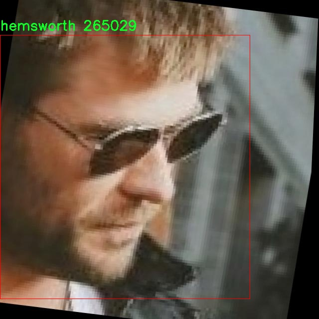

# 人脸识别检测系统源码分享
 # [一条龙教学YOLOV8标注好的数据集一键训练_70+全套改进创新点发刊_Web前端展示]

### 1.研究背景与意义

项目参考[AAAI Association for the Advancement of Artificial Intelligence](https://gitee.com/qunmasj/projects)

研究背景与意义

随着人工智能技术的迅猛发展，计算机视觉领域的研究逐渐成为学术界和工业界的热点。人脸识别作为计算机视觉中的重要应用之一，因其在安全监控、身份验证、社交媒体、智能家居等领域的广泛应用而备受关注。近年来，深度学习技术的进步为人脸识别系统的性能提升提供了新的机遇，尤其是基于卷积神经网络（CNN）的目标检测算法，如YOLO（You Only Look Once）系列模型，因其高效性和实时性而被广泛应用于人脸检测和识别任务。

本研究旨在基于改进的YOLOv8模型，构建一个高效的人脸识别检测系统。YOLOv8作为YOLO系列的最新版本，具备更强的特征提取能力和更快的推理速度，能够在复杂环境中实现高精度的人脸检测。通过对YOLOv8的改进，结合适当的数据集，我们期望进一步提升人脸识别的准确性和鲁棒性。

本研究所使用的数据集包含6181张图像，涵盖41个类别的人脸样本。这些类别包括知名公众人物如巴拉克·奥巴马、艾玛·沃森、克里斯·海姆斯沃斯等，涵盖了不同性别、年龄和种族的人脸特征。这种多样性使得数据集在训练过程中能够有效地提高模型的泛化能力，增强其在实际应用中的适应性。此外，数据集中包含的图像数量和类别的丰富性为模型的训练提供了充足的样本，有助于避免过拟合现象，从而提升模型的整体性能。

在当前的人脸识别研究中，如何在保证高识别率的同时降低误识别率，仍然是一个亟待解决的问题。通过对YOLOv8模型的改进，我们可以探索更有效的特征提取和融合方法，以提升模型在复杂场景下的表现。同时，结合数据集中的多样化样本，我们可以针对不同的人脸特征进行深入分析，进而优化模型的训练策略和参数设置，以实现更高的识别精度。

此外，随着社会对隐私保护的日益重视，人脸识别技术的应用也面临着伦理和法律的挑战。因此，研究如何在确保技术性能的同时，兼顾用户隐私和数据安全，将是本研究的重要组成部分。通过建立一个高效且合规的人脸识别检测系统，我们希望能够为相关领域提供理论支持和实践指导，推动人脸识别技术的健康发展。

综上所述，本研究基于改进YOLOv8的人脸识别检测系统，不仅有助于提升人脸识别的技术水平，还能为相关应用提供切实可行的解决方案。通过对数据集的充分利用和模型的不断优化，我们期待能够在这一领域取得新的突破，为未来的人脸识别研究和应用奠定坚实的基础。

### 2.图片演示


##### 注意：由于此博客编辑较早，上面“2.图片演示”和“3.视频演示”展示的系统图片或者视频可能为老版本，新版本在老版本的基础上升级如下：（实际效果以升级的新版本为准）

  （1）适配了YOLOV8的“目标检测”模型和“实例分割”模型，通过加载相应的权重（.pt）文件即可自适应加载模型。

  （2）支持“图片识别”、“视频识别”、“摄像头实时识别”三种识别模式。

  （3）支持“图片识别”、“视频识别”、“摄像头实时识别”三种识别结果保存导出，解决手动导出（容易卡顿出现爆内存）存在的问题，识别完自动保存结果并导出到。

  （4）支持Web前端系统中的标题、背景图等自定义修改，后面提供修改教程。

  另外本项目提供训练的数据集和训练教程,暂不提供权重文件（best.pt）,需要您按照教程进行训练后实现图片演示和Web前端界面演示的效果。

### 3.视频演示

[3.1 视频演示](https://www.bilibili.com/video/BV1Y5WoePE6f/?vd_source=bc9aec86d164b67a7004b996143742dc)

### 4.数据集信息展示

数据集信息展示

本数据集名为“facerecognition”，专为改进YOLOv8的人脸识别检测系统而设计，包含了6181张图像，涵盖了41个不同的类别。这些类别包括了多位知名人士的面孔，如adriana、alexandra、alvaro等，直至国际知名的政治人物如barack和obama，以及娱乐圈的明星如amber、hemsworth和watson。每个类别的选择不仅考虑了多样性，还确保了数据集的代表性，使得模型在实际应用中能够具备更强的泛化能力。

数据集中每一张图像都经过精心标注，确保了人脸特征的准确识别。这些图像的来源广泛，涵盖了不同的光照条件、角度和背景，使得模型在训练过程中能够学习到更为复杂的场景变化。通过这种多样化的训练数据，YOLOv8能够更好地适应现实世界中人脸识别的挑战，提升其在不同环境下的检测准确率。

在类别的选择上，数据集不仅包括了常见的公众人物，还涵盖了一些较为冷门的面孔，这样的设计旨在增强模型对不同人脸特征的识别能力。比如，数据集中包含了来自不同文化背景和种族的人物，确保了模型在多元化人群中的表现。此类设计理念符合当前人工智能领域对公平性和包容性的追求，能够有效减少模型在实际应用中可能出现的偏见。

此外，数据集的许可为CC BY 4.0，这意味着用户可以自由使用、修改和分发数据集，只需适当归属原作者。这种开放的许可政策鼓励了学术界和工业界的广泛使用，促进了人脸识别技术的研究与发展。研究人员和开发者可以在此基础上进行进一步的实验，推动人脸识别技术的进步。

在实际应用中，改进后的YOLOv8模型将能够在实时视频监控、社交媒体内容审核以及智能安防等多个领域发挥重要作用。随着人脸识别技术的不断成熟，其应用场景也在不断扩展，从传统的身份验证到更为复杂的情感分析和行为识别，数据集的多样性和丰富性将为这些应用提供坚实的基础。

总之，本数据集不仅在数量上具有优势，更在质量和多样性上为人脸识别的研究提供了强有力的支持。通过利用这些数据，研究人员可以探索更为先进的算法，提升YOLOv8在人脸识别领域的性能，推动技术的进步与应用的普及。




### 5.全套项目环境部署视频教程（零基础手把手教学）

[5.1 环境部署教程链接（零基础手把手教学）](https://www.ixigua.com/7404473917358506534?logTag=c807d0cbc21c0ef59de5)


[5.2 安装Python虚拟环境创建和依赖库安装视频教程链接（零基础手把手教学）](https://www.ixigua.com/7404474678003106304?logTag=1f1041108cd1f708b01a)

### 6.手把手YOLOV8训练视频教程（零基础小白有手就能学会）

[6.1 环境部署教程链接（零基础手把手教学）](https://www.ixigua.com/7404477157818401292?logTag=d31a2dfd1983c9668658)

### 7.70+种全套YOLOV8创新点代码加载调参视频教程（一键加载写好的改进模型的配置文件）

[7.1 环境部署教程链接（零基础手把手教学）](https://www.ixigua.com/7404478314661806627?logTag=29066f8288e3f4eea3a4)

### 8.70+种全套YOLOV8创新点原理讲解（非科班也可以轻松写刊发刊，V10版本正在科研待更新）

由于篇幅限制，每个创新点的具体原理讲解就不一一展开，具体见下列网址中的创新点对应子项目的技术原理博客网址【Blog】：


[8.1 70+种全套YOLOV8创新点原理讲解链接](https://gitee.com/qunmasj/good)

### 9.系统功能展示（检测对象为举例，实际内容以本项目数据集为准）

图1.系统支持检测结果表格显示

  图2.系统支持置信度和IOU阈值手动调节

  图3.系统支持自定义加载权重文件best.pt(需要你通过步骤5中训练获得)

  图4.系统支持摄像头实时识别

  图5.系统支持图片识别

  图6.系统支持视频识别

  图7.系统支持识别结果文件自动保存

  图8.系统支持Excel导出检测结果数据


### 10.原始YOLOV8算法原理

原始YOLOv8算法原理

YOLOv8是目标检测领域中的一项重要进展，由Ultralytics公司于2023年1月10日发布。作为YOLO系列的最新版本，YOLOv8在YOLOv7的基础上进行了多方面的优化和改进，展现出更高的检测精度和更快的处理速度。YOLOv8的核心理念是将整个图像作为输入，利用深度卷积神经网络（CNN）直接进行目标检测和定位，这一过程不再依赖传统的滑动窗口或区域提议方法，从而显著提高了检测的效率和准确性。

YOLOv8采用了更深的卷积神经网络结构，增强了特征提取的能力。其网络结构主要分为四个部分：输入端、骨干网络、颈部网络和头部网络。输入端通过马赛克数据增强、自适应锚框计算和自适应灰度填充等技术，为后续的特征提取提供了丰富的输入数据。骨干网络采用了C2f模块和空间金字塔池化融合（SPPF）结构，C2f模块通过跨层连接和多分支设计，增强了模型的梯度流和特征表示能力，使得网络能够更有效地学习到复杂的特征信息。

在颈部网络部分，YOLOv8引入了路径聚合网络（PAN）结构，这一设计旨在增强网络对不同尺度对象的特征融合能力。PAN通过对不同层次的特征进行有效整合，使得模型在处理多尺度目标时表现得更加出色。这种结构的引入，进一步提升了YOLOv8在复杂场景下的检测性能。

头部网络则是YOLOv8的一大创新点。与以往版本的耦合头结构不同，YOLOv8采用了解耦头结构，将分类和检测过程分开进行。这一设计不仅提高了模型的灵活性，还优化了损失计算过程。YOLOv8使用了Task-Aligned Assigner策略，根据分类与回归的分数加权结果选择正样本，从而提高了正负样本的分配效率。损失计算方面，YOLOv8结合了二元交叉熵损失（BCELoss）、分布焦点损失（DFLoss）和完全交并比损失（CIOULoss），在分类和回归两个分支中分别进行训练，以提升模型对边界框预测的精准性。

YOLOv8的另一个显著特点是其轻量化设计。通过对不同尺度模型调整通道数，YOLOv8实现了模型结构的精简，进一步提升了性能。这种轻量化设计使得YOLOv8在各种应用场景中都能保持高效的实时性，尤其是在智能监控、自动驾驶和人脸识别等领域，展现出优异的应用潜力。

在实际应用中，YOLOv8展现出了相较于其他目标检测算法的显著优势。例如，与SSD算法相比，YOLOv8在精度上提高了43.23%，而帧率则提升了10.28倍。这种性能的提升使得YOLOv8在目标检测分析中更具竞争力，能够满足更高的实时性和准确性需求。因此，YOLOv8被广泛应用于各类实际场景中，成为研究者和工程师们的首选工具。

综上所述，YOLOv8算法的原理不仅体现在其深度卷积神经网络的结构设计上，更在于其创新的损失计算策略和轻量化的模型设计。通过对特征提取、特征融合和目标检测过程的全面优化，YOLOv8在目标检测领域中树立了新的标杆，展现出强大的应用潜力和广泛的适用性。随着技术的不断进步，YOLOv8无疑将在未来的研究和应用中发挥更为重要的作用。


### 11.项目核心源码讲解（再也不用担心看不懂代码逻辑）

#### 11.1 ultralytics\models\nas\predict.py

以下是经过简化和注释的核心代码部分，保留了最重要的功能和逻辑：

```python
import torch
from ultralytics.engine.predictor import BasePredictor
from ultralytics.engine.results import Results
from ultralytics.utils import ops

class NASPredictor(BasePredictor):
    """
    Ultralytics YOLO NAS预测器，用于目标检测。

    该类扩展了Ultralytics引擎中的`BasePredictor`，负责对YOLO NAS模型生成的原始预测结果进行后处理。
    它应用了非极大值抑制（NMS）和将边界框缩放到原始图像尺寸等操作。

    属性:
        args (Namespace): 包含各种后处理配置的命名空间。
    """

    def postprocess(self, preds_in, img, orig_imgs):
        """对预测结果进行后处理，并返回Results对象的列表。"""

        # 将预测框转换为xywh格式，并合并类分数
        boxes = ops.xyxy2xywh(preds_in[0][0])  # 将预测框从xyxy格式转换为xywh格式
        preds = torch.cat((boxes, preds_in[0][1]), -1).permute(0, 2, 1)  # 合并边界框和类分数，并调整维度

        # 应用非极大值抑制（NMS）来过滤重叠的预测框
        preds = ops.non_max_suppression(
            preds,
            self.args.conf,  # 置信度阈值
            self.args.iou,   # IOU阈值
            agnostic=self.args.agnostic_nms,  # 是否对类别不敏感
            max_det=self.args.max_det,  # 最大检测数量
            classes=self.args.classes,   # 需要检测的类别
        )

        # 如果输入图像不是列表，则将其转换为numpy数组
        if not isinstance(orig_imgs, list):
            orig_imgs = ops.convert_torch2numpy_batch(orig_imgs)

        results = []  # 存储结果的列表
        for i, pred in enumerate(preds):
            orig_img = orig_imgs[i]  # 获取原始图像
            # 将预测框缩放到原始图像的尺寸
            pred[:, :4] = ops.scale_boxes(img.shape[2:], pred[:, :4], orig_img.shape)
            img_path = self.batch[0][i]  # 获取图像路径
            # 创建Results对象并添加到结果列表
            results.append(Results(orig_img, path=img_path, names=self.model.names, boxes=pred))
        
        return results  # 返回后处理的结果列表
```

### 代码说明：
1. **类定义**：`NASPredictor`类继承自`BasePredictor`，用于处理YOLO NAS模型的预测结果。
2. **postprocess方法**：这是核心方法，负责对输入的预测结果进行后处理。
   - **预测框转换**：将预测框从`xyxy`格式转换为`xywh`格式，并与类分数合并。
   - **非极大值抑制**：使用NMS算法来过滤掉重叠的预测框，以减少冗余检测。
   - **图像格式转换**：确保原始图像以numpy数组的形式存在，以便后续处理。
   - **结果构建**：遍历每个预测结果，缩放边界框到原始图像的尺寸，并创建`Results`对象以存储最终结果。

这个文件是Ultralytics YOLO（You Only Look Once）NAS（Neural Architecture Search）模型的预测模块，主要负责对模型生成的原始预测结果进行后处理。文件中定义了一个名为`NASPredictor`的类，该类继承自`BasePredictor`，并实现了对YOLO NAS模型的预测结果进行后处理的功能。

在这个类中，`postprocess`方法是核心功能。它接收三个参数：`preds_in`（模型的原始预测结果）、`img`（输入图像）和`orig_imgs`（原始图像）。该方法的主要任务是将原始预测结果转换为可用的检测结果。

首先，方法通过调用`ops.xyxy2xywh`将预测框的坐标从`xyxy`格式（左上角和右下角坐标）转换为`xywh`格式（中心点坐标和宽高）。接着，将预测框和相应的类别分数合并，并进行维度调整，以便后续处理。

接下来，使用`ops.non_max_suppression`进行非极大值抑制（NMS），这是一种常用的后处理技术，用于去除冗余的重叠框，只保留最有可能的检测结果。NMS的参数包括置信度阈值、IoU阈值、是否使用类别无关的NMS、最大检测数量以及需要检测的类别。

在处理完预测结果后，方法检查输入的原始图像是否为列表形式。如果不是，则将其转换为NumPy数组格式，以便后续处理。然后，方法遍历每个预测结果，使用`ops.scale_boxes`将预测框的坐标缩放到原始图像的尺寸。最后，将每个结果封装为`Results`对象，并将其添加到结果列表中。

这个类通常不会被直接实例化，而是在`NAS`类内部使用。通过这种设计，用户可以方便地使用YOLO NAS模型进行目标检测，而无需关心底层的实现细节。整体上，这个文件的代码结构清晰，功能明确，能够有效地处理YOLO NAS模型的预测结果。

#### 11.2 ui.py

```python
import sys
import subprocess

def run_script(script_path):
    """
    使用当前 Python 环境运行指定的脚本。

    Args:
        script_path (str): 要运行的脚本路径

    Returns:
        None
    """
    # 获取当前 Python 解释器的路径
    python_path = sys.executable

    # 构建运行命令
    command = f'"{python_path}" -m streamlit run "{script_path}"'

    # 执行命令
    result = subprocess.run(command, shell=True)
    if result.returncode != 0:
        print("脚本运行出错。")


# 实例化并运行应用
if __name__ == "__main__":
    # 指定您的脚本路径
    script_path = "web.py"  # 这里可以直接指定脚本路径

    # 运行脚本
    run_script(script_path)
```

### 代码注释

1. **导入模块**：
   - `import sys`：导入 sys 模块以访问与 Python 解释器相关的变量和函数。
   - `import subprocess`：导入 subprocess 模块以便能够在 Python 中执行外部命令。

2. **定义函数 `run_script`**：
   - 该函数接受一个参数 `script_path`，表示要运行的 Python 脚本的路径。
   - 使用 `sys.executable` 获取当前 Python 解释器的路径，以确保使用正确的 Python 环境来运行脚本。
   - 构建一个命令字符串，使用 `streamlit` 模块运行指定的脚本。
   - 使用 `subprocess.run` 执行构建的命令。如果命令执行失败（返回码不为 0），则打印错误信息。

3. **主程序入口**：
   - 使用 `if __name__ == "__main__":` 确保只有在直接运行该脚本时才会执行以下代码。
   - 指定要运行的脚本路径 `script_path`，这里直接赋值为 `"web.py"`。
   - 调用 `run_script` 函数，传入脚本路径以运行该脚本。

这个程序文件的主要功能是通过当前的 Python 环境来运行一个指定的脚本，具体来说是一个名为 `web.py` 的脚本。程序首先导入了必要的模块，包括 `sys`、`os` 和 `subprocess`，以及一个自定义的 `abs_path` 函数，用于获取脚本的绝对路径。

在 `run_script` 函数中，首先获取当前 Python 解释器的路径，这样可以确保在正确的环境中运行脚本。接着，构建一个命令字符串，这个命令使用 `streamlit` 来运行指定的脚本。`streamlit` 是一个用于构建数据应用的框架，通常用于快速创建交互式的 Web 应用。

然后，使用 `subprocess.run` 方法来执行这个命令。该方法会在一个新的 shell 中运行命令，并等待其完成。如果脚本运行过程中出现错误，返回的状态码将不为零，此时程序会打印出“脚本运行出错”的提示信息。

在文件的最后部分，使用 `if __name__ == "__main__":` 语句来确保只有在直接运行该文件时才会执行后面的代码。在这里，指定了要运行的脚本路径为 `web.py`，并调用 `run_script` 函数来执行这个脚本。

总的来说，这个程序文件的作用是提供一个简单的接口，通过命令行运行一个特定的 Python 脚本，并处理可能出现的错误。

#### 11.3 ultralytics\nn\autobackend.py

以下是经过简化和注释的核心代码部分，主要集中在模型加载和推理的逻辑上：

```python
import torch
import torch.nn as nn
from ultralytics.utils import LOGGER, yaml_load

class AutoBackend(nn.Module):
    """
    处理Ultralytics YOLO模型的动态后端选择，用于推理。
    """

    @torch.no_grad()
    def __init__(self, weights="yolov8n.pt", device=torch.device("cpu"), fp16=False, data=None):
        """
        初始化AutoBackend以进行推理。

        参数:
            weights (str): 模型权重文件的路径，默认为'yolov8n.pt'。
            device (torch.device): 运行模型的设备，默认为CPU。
            fp16 (bool): 启用半精度推理，仅在特定后端支持，默认为False。
            data (str | Path | optional): 包含类名的额外data.yaml文件的路径，默认为None。
        """
        super().__init__()
        self.device = device
        self.fp16 = fp16

        # 加载模型
        model_type = self._model_type(weights)
        if model_type[0]:  # 如果是PyTorch模型
            self.model = torch.load(weights, map_location=device)
            if fp16:
                self.model.half()  # 转换为半精度
        else:
            raise TypeError(f"不支持的模型格式: {weights}")

        # 加载类名
        self.names = self._load_class_names(data)

    def _load_class_names(self, data):
        """加载类名"""
        if data:
            return yaml_load(data)["names"]
        return {i: f"class{i}" for i in range(999)}  # 默认类名

    def forward(self, im):
        """
        在YOLOv8 MultiBackend模型上运行推理。

        参数:
            im (torch.Tensor): 要进行推理的图像张量。

        返回:
            (torch.Tensor): 推理结果的张量。
        """
        if self.fp16:
            im = im.half()  # 转换为半精度
        return self.model(im)  # 执行推理

    @staticmethod
    def _model_type(p):
        """
        根据模型文件路径返回模型类型。

        参数:
            p: 模型文件的路径。
        """
        # 检查文件后缀以确定模型类型
        suffixes = ['.pt', '.onnx', '.pb']  # 支持的后缀
        return [p.endswith(suffix) for suffix in suffixes]  # 返回后缀匹配的布尔值列表
```

### 代码注释说明：
1. **类 `AutoBackend`**：这是一个处理不同模型格式的类，旨在简化推理过程。
2. **`__init__` 方法**：初始化模型，加载权重和类名。根据权重文件的类型，选择相应的加载方式。
3. **`_load_class_names` 方法**：从指定的 YAML 文件中加载类名，如果没有提供，则返回默认的类名。
4. **`forward` 方法**：执行推理，接收输入图像并返回模型的输出。
5. **`_model_type` 方法**：根据文件后缀判断模型的类型，返回一个布尔值列表，指示支持的模型格式。

以上代码是对原始代码的简化，保留了核心功能并增加了详细的中文注释，以便更好地理解每个部分的作用。

这个程序文件 `ultralytics/nn/autobackend.py` 是一个用于处理 Ultralytics YOLO 模型推理的自动后端选择类。它的主要功能是根据输入的模型格式动态选择合适的推理引擎，从而支持多种深度学习框架和模型格式的推理。

首先，文件中导入了一些必要的库，包括标准库（如 `ast`, `contextlib`, `json`, `platform`, `zipfile`）和第三方库（如 `cv2`, `numpy`, `torch`, `PIL`）。这些库提供了处理数据、图像和深度学习模型所需的功能。

文件中定义了几个辅助函数。`check_class_names` 函数用于检查和转换类名，确保它们符合预期的格式。`default_class_names` 函数则提供默认的类名，如果在输入的 YAML 文件中找不到类名，则返回一组默认的类名。

核心类 `AutoBackend` 继承自 `torch.nn.Module`，用于处理不同格式模型的加载和推理。构造函数 `__init__` 接受多个参数，包括模型权重文件路径、设备类型、是否使用 DNN 模块、数据文件路径、是否使用半精度推理等。根据输入的模型格式，构造函数会调用不同的方法来加载模型，例如 PyTorch、TorchScript、ONNX、OpenVINO、TensorRT 等。

在模型加载过程中，程序会检查模型文件的后缀名，以确定其格式，并相应地加载模型。对于每种格式，程序会记录必要的元数据，例如模型的输入输出名称、批处理大小、图像大小等。

`forward` 方法是该类的核心方法，用于执行推理。它接受一个图像张量作为输入，并根据模型的类型执行推理。不同的模型格式有不同的处理方式，例如 PyTorch 模型直接调用 `self.model(im)`，而 ONNX 模型则需要使用 `onnxruntime` 库进行推理。

此外，`warmup` 方法用于通过运行一次前向传递来预热模型，以提高后续推理的速度。`_model_type` 静态方法用于确定模型文件的类型，返回一个布尔值列表，指示模型的格式。

总体而言，这个文件提供了一个灵活的框架，使得用户可以方便地在不同的后端之间切换，执行 YOLO 模型的推理，而无需关心底层实现的细节。它的设计使得模型的部署变得更加简单和高效，适用于多种应用场景。

#### 11.4 train.py

以下是代码中最核心的部分，并附上详细的中文注释：

```python
import os
import torch
import yaml
from ultralytics import YOLO  # 导入YOLO模型库
from QtFusion.path import abs_path  # 导入获取绝对路径的函数

# 确定使用的设备，如果有可用的GPU则使用GPU，否则使用CPU
device = "0" if torch.cuda.is_available() else "cpu"

if __name__ == '__main__':  # 确保该模块被直接运行时才执行以下代码
    workers = 1  # 设置数据加载的工作进程数
    batch = 2    # 设置每个批次的大小

    data_name = "data"  # 数据集名称
    # 获取数据集yaml文件的绝对路径
    data_path = abs_path(f'datasets/{data_name}/{data_name}.yaml', path_type='current')  
    unix_style_path = data_path.replace(os.sep, '/')  # 将路径转换为Unix风格

    # 获取数据集所在目录的路径
    directory_path = os.path.dirname(unix_style_path)
    
    # 读取YAML文件，保持原有顺序
    with open(data_path, 'r') as file:
        data = yaml.load(file, Loader=yaml.FullLoader)
    
    # 如果YAML文件中有'path'项，则修改为当前目录路径
    if 'path' in data:
        data['path'] = directory_path
        # 将修改后的数据写回YAML文件
        with open(data_path, 'w') as file:
            yaml.safe_dump(data, file, sort_keys=False)

    # 加载预训练的YOLOv8模型
    model = YOLO(model='./ultralytics/cfg/models/v8/yolov8s.yaml', task='detect')  
    
    # 开始训练模型
    results2 = model.train(
        data=data_path,  # 指定训练数据的配置文件路径
        device=device,  # 指定使用的设备
        workers=workers,  # 指定数据加载的工作进程数
        imgsz=640,  # 指定输入图像的大小为640x640
        epochs=100,  # 指定训练的轮数为100
        batch=batch,  # 指定每个批次的大小
        name='train_v8_' + data_name  # 指定训练任务的名称
    )
```

### 代码核心部分说明：
1. **设备选择**：通过`torch.cuda.is_available()`判断是否有可用的GPU，选择相应的设备进行训练。
2. **数据集路径处理**：通过`abs_path`函数获取数据集的绝对路径，并确保路径格式为Unix风格，以便于跨平台使用。
3. **YAML文件读取与修改**：读取数据集的配置文件，修改其中的`path`项为当前目录路径，并将修改后的内容写回文件。
4. **模型加载与训练**：加载YOLOv8模型，并通过`model.train()`方法开始训练，指定数据路径、设备、工作进程数、图像大小、训练轮数和批次大小等参数。

这个程序文件 `train.py` 是用于训练 YOLOv8 模型的脚本。首先，它导入了必要的库，包括 `os`、`torch`、`yaml` 和 `ultralytics` 中的 YOLO 模型。接着，程序通过判断是否有可用的 GPU 来设置设备，选择使用 GPU 还是 CPU。

在 `if __name__ == '__main__':` 语句下，程序开始执行主要的训练逻辑。首先定义了一些参数，包括工作进程数 `workers` 和批次大小 `batch`。接着，程序指定了数据集的名称为 "data"，并构建了该数据集 YAML 文件的绝对路径。使用 `abs_path` 函数确保路径是正确的，并将路径中的分隔符统一为 Unix 风格。

然后，程序获取数据集的目录路径，并打开 YAML 文件读取其内容。通过 `yaml.load` 方法读取数据，并保持原有的顺序。程序检查 YAML 文件中是否包含 `path` 项，如果有，则将其修改为数据集的目录路径，并将修改后的内容写回 YAML 文件，确保后续训练时可以正确找到数据集。

接下来，程序加载了预训练的 YOLOv8 模型，指定了模型的配置文件。然后，调用 `model.train` 方法开始训练模型。在训练过程中，程序指定了训练数据的配置文件路径、设备、工作进程数、输入图像的大小（640x640）、训练的轮数（100个 epoch）以及每个批次的大小（2）。最后，训练任务的名称也被设置为 `'train_v8_' + data_name`，以便于识别和管理。

总的来说，这个脚本的主要功能是配置并启动 YOLOv8 模型的训练过程，确保数据集路径正确，并设置训练的相关参数。

#### 11.5 ultralytics\models\yolo\detect\predict.py

以下是代码中最核心的部分，并附上详细的中文注释：

```python
from ultralytics.engine.predictor import BasePredictor
from ultralytics.engine.results import Results
from ultralytics.utils import ops

class DetectionPredictor(BasePredictor):
    """
    DetectionPredictor类，继承自BasePredictor类，用于基于检测模型进行预测。
    """

    def postprocess(self, preds, img, orig_imgs):
        """
        对预测结果进行后处理，并返回Results对象的列表。

        参数:
        preds: 模型的预测结果
        img: 输入图像
        orig_imgs: 原始图像（可能是torch.Tensor格式）

        返回:
        results: 包含后处理结果的Results对象列表
        """
        # 应用非极大值抑制（NMS）来过滤预测框
        preds = ops.non_max_suppression(
            preds,
            self.args.conf,  # 置信度阈值
            self.args.iou,   # IOU阈值
            agnostic=self.args.agnostic_nms,  # 是否使用类别无关的NMS
            max_det=self.args.max_det,  # 最大检测框数量
            classes=self.args.classes,   # 需要检测的类别
        )

        # 如果输入的原始图像不是列表格式，则将其转换为numpy数组
        if not isinstance(orig_imgs, list):  # 输入图像是torch.Tensor，而不是列表
            orig_imgs = ops.convert_torch2numpy_batch(orig_imgs)

        results = []  # 存储后处理结果的列表
        for i, pred in enumerate(preds):
            orig_img = orig_imgs[i]  # 获取对应的原始图像
            # 将预测框的坐标从当前图像的尺寸缩放到原始图像的尺寸
            pred[:, :4] = ops.scale_boxes(img.shape[2:], pred[:, :4], orig_img.shape)
            img_path = self.batch[0][i]  # 获取当前图像的路径
            # 创建Results对象并添加到结果列表中
            results.append(Results(orig_img, path=img_path, names=self.model.names, boxes=pred))
        
        return results  # 返回后处理的结果列表
```

### 代码核心部分说明：
1. **类定义**：`DetectionPredictor`类用于处理检测模型的预测。
2. **后处理方法**：`postprocess`方法负责对模型的预测结果进行后处理，包括应用非极大值抑制（NMS）来去除冗余的检测框，并将预测框的坐标缩放到原始图像的尺寸。
3. **结果存储**：将处理后的结果存储在`Results`对象中，并返回一个包含所有结果的列表。

这个程序文件是Ultralytics YOLO模型的一部分，主要用于目标检测的预测。文件中定义了一个名为`DetectionPredictor`的类，它继承自`BasePredictor`类，专门用于基于检测模型进行预测。

在这个类的文档字符串中，提供了一个使用示例，展示了如何使用`DetectionPredictor`类进行预测。示例中，首先从`ultralytics.utils`导入了`ASSETS`，然后从`ultralytics.models.yolo.detect`导入了`DetectionPredictor`。接着，创建了一个包含模型路径和数据源的字典`args`，然后实例化了`DetectionPredictor`对象，并调用`predict_cli()`方法进行预测。

`DetectionPredictor`类中有一个名为`postprocess`的方法，该方法用于对预测结果进行后处理。它接收三个参数：`preds`（预测结果）、`img`（输入图像）和`orig_imgs`（原始图像）。在方法内部，首先调用`ops.non_max_suppression`函数对预测结果进行非极大值抑制，以过滤掉重叠的框，保留最有可能的检测结果。该函数使用了一些参数，如置信度阈值、IOU阈值、是否使用类无关的NMS、最大检测数量和需要检测的类别。

接下来，方法检查`orig_imgs`是否为列表，如果不是，则将其转换为NumPy数组。然后，创建一个空的结果列表`results`，并对每个预测结果进行处理。对于每个预测，首先获取对应的原始图像，并使用`ops.scale_boxes`函数将预测框的坐标缩放到原始图像的尺寸。接着，获取图像的路径，并将原始图像、路径、模型名称和预测框信息封装成`Results`对象，添加到结果列表中。

最后，`postprocess`方法返回处理后的结果列表。这个类和方法的设计使得用户能够方便地进行目标检测，并对结果进行后处理，以便于后续的分析和应用。

#### 11.6 chinese_name_list.py

以下是经过简化和详细注释后的核心代码部分：

```python
# -*- coding: utf-8 -*-

# 创建一个字典，包含中文名称和对应的英文标签
Chinese_name = {'person': "人"}

# 从字典中提取所有的值，生成一个列表
Label_list = list(Chinese_name.values())

# 此时，Label_list 将包含 ['人']，即字典中所有的中文名称
```

### 代码解释：
1. `# -*- coding: utf-8 -*-`：这行声明了文件的编码格式为 UTF-8，确保可以正确处理中文字符。
2. `Chinese_name = {'person': "人"}`：定义一个字典 `Chinese_name`，其中键为英文标签 `'person'`，值为对应的中文名称 `'人'`。
3. `Label_list = list(Chinese_name.values())`：使用 `values()` 方法提取字典中的所有值，并将其转换为列表，赋值给 `Label_list`。此时，`Label_list` 中将包含字典中的所有中文名称。

这个程序文件的名称是 `chinese_name_list.py`，它的主要功能是定义一个包含中文名称的字典，并从中提取出值生成一个列表。

首先，文件的开头有一行注释 `# -*- coding: utf-8 -*-`，这行代码指定了文件的编码格式为 UTF-8，确保程序能够正确处理中文字符。

接下来，程序定义了一个字典 `Chinese_name`，这个字典的键是 `'person'`，对应的值是 `"人"`。这个字典的设计可以用于存储与中文名称相关的信息，当前仅包含一个键值对。

然后，程序使用 `list(Chinese_name.values())` 这一行代码从字典中提取出所有的值，并将这些值转换成一个列表。这里，`Chinese_name.values()` 方法返回字典中所有的值，而 `list()` 函数则将这些值转换为列表形式。最终，生成的列表被赋值给变量 `Label_list`。

综上所述，这段代码的功能是创建一个包含中文名称的字典，并从中提取出所有的值形成一个列表，方便后续使用。

### 12.系统整体结构（节选）

### 整体功能和构架概括

该项目主要是一个基于Ultralytics YOLO（You Only Look Once）模型的目标检测框架。它提供了模型训练、推理和结果处理的功能，支持多种深度学习后端，并能够处理中文名称列表。项目的结构清晰，各个模块之间通过类和函数进行协作，便于扩展和维护。

以下是各个文件的功能概述：

| 文件路径                                   | 功能描述                                                                                     |
|--------------------------------------------|----------------------------------------------------------------------------------------------|
| `ultralytics/models/nas/predict.py`       | 实现YOLO NAS模型的预测后处理，转换原始预测结果为可用的检测结果，并进行非极大值抑制。           |
| `ui.py`                                    | 提供一个接口，通过命令行运行指定的Python脚本（如`web.py`），用于启动应用程序。                |
| `ultralytics/nn/autobackend.py`           | 根据输入模型格式动态选择合适的推理引擎，支持多种深度学习框架的模型加载和推理。               |
| `train.py`                                 | 配置并启动YOLOv8模型的训练过程，确保数据集路径正确，并设置训练的相关参数。                   |
| `ultralytics/models/yolo/detect/predict.py` | 实现YOLO模型的目标检测预测，处理预测结果并返回可用的检测结果。                               |
| `chinese_name_list.py`                     | 定义一个包含中文名称的字典，并从中提取出值生成一个列表，便于后续使用。                        |
| `ultralytics/__init__.py`                  | 初始化Ultralytics包，通常用于定义包的元数据和导入必要的模块。                               |
| `ultralytics/engine/__init__.py`           | 初始化引擎模块，可能包含与模型训练和推理相关的功能和类。                                     |
| `ultralytics/models/yolo/pose/predict.py`  | 实现YOLO模型的姿态估计预测，处理姿态估计的相关逻辑和结果。                                   |
| `ultralytics/models/yolo/detect/val.py`     | 实现YOLO模型的验证过程，通常用于评估模型在验证集上的性能。                                   |

这个表格总结了项目中各个文件的功能，展示了项目的模块化设计和各个组件之间的关系。整体上，项目旨在提供一个高效、灵活的目标检测解决方案，支持多种应用场景。

注意：由于此博客编辑较早，上面“11.项目核心源码讲解（再也不用担心看不懂代码逻辑）”中部分代码可能会优化升级，仅供参考学习，完整“训练源码”、“Web前端界面”和“70+种创新点源码”以“13.完整训练+Web前端界面+70+种创新点源码、数据集获取”的内容为准。

### 13.完整训练+Web前端界面+70+种创新点源码、数据集获取（由于版权原因，本博客仅提供【[原始博客的链接]()】，原始博客提供下载链接）


#完整训练+Web前端界面+70+种创新点源码、数据集获取链接

https://mbd.pub/o/bread/ZpqUlp9r